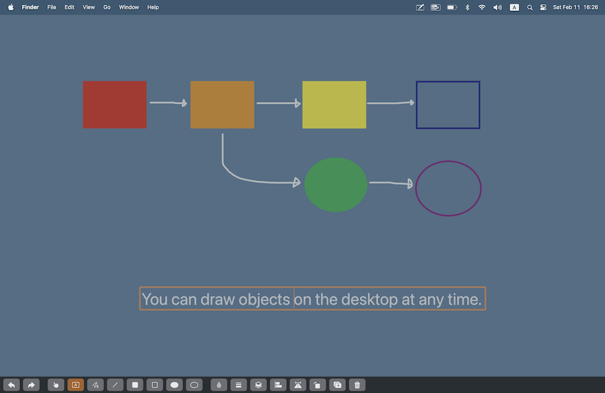

# ScreenNote

Paint Tool for Desktop

AppStore [Download](https://apps.apple.com/us/app/screennote/id1258500140)

## Requirements

- macOS 15.0+

## Architecture

This project is built using an architecture called [LUCA](https://github.com/Kyome22/LUCA).
Please refer to the following article for more details.

https://dev.to/kyome22/luca-a-modern-architecture-for-swiftui-development-3g2i
